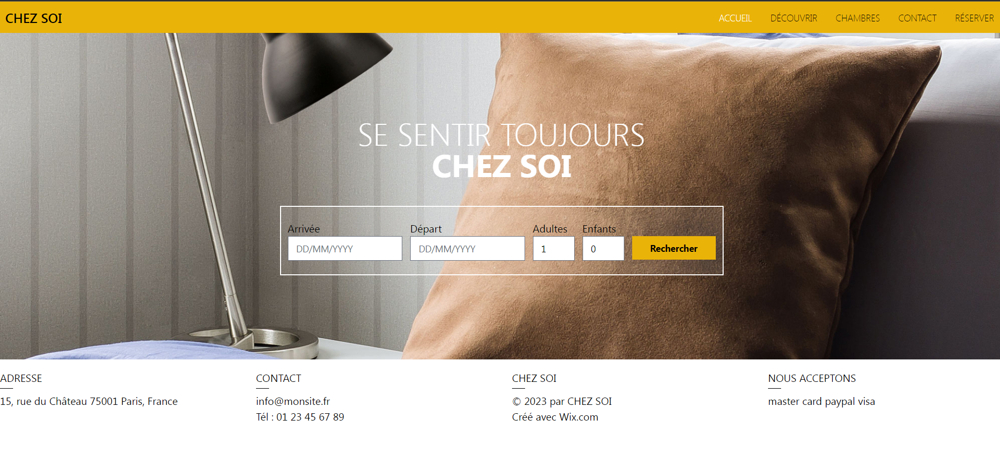

# Hotel reservation

  

  1- Backend: 
I'm using Spring boot with:
   - Spring Data JPA
   - Thymeleaf
   - Spring Session (core + JDBC)
   - Spring mail
   - Spring Validation
   
  + libs:
   - <a href="https://github.com/DiUS/java-faker">JavaFaker</a>
   - <a href="https://github.com/slugify/slugify">Slugify</a>
   
  2- Frontend: 
  I'm using:
   
  - AlpineJS
   
  - tailwindcss
  

